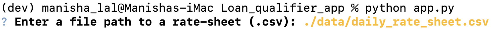
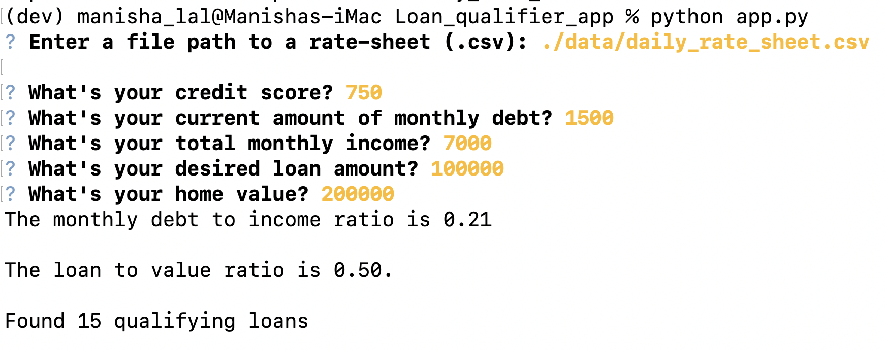
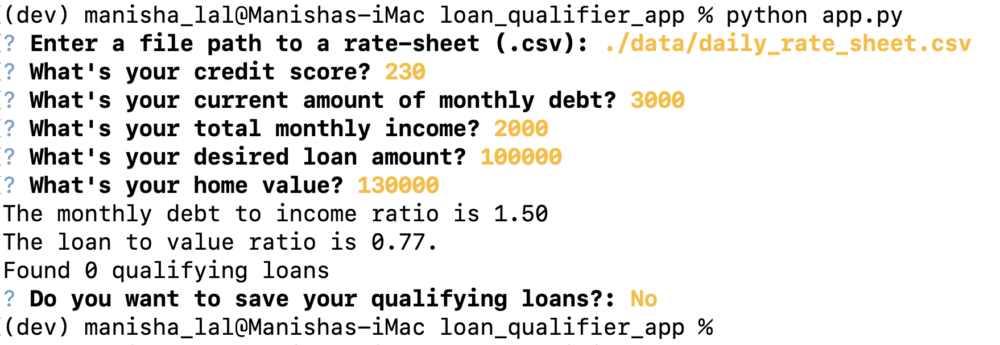
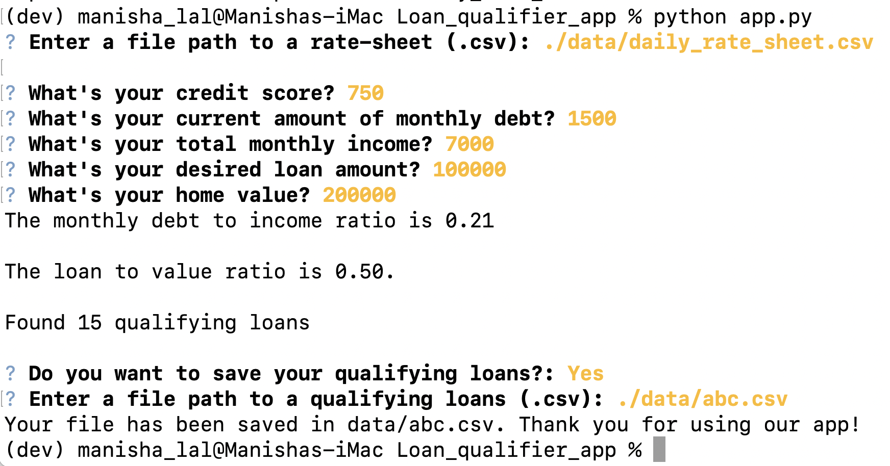
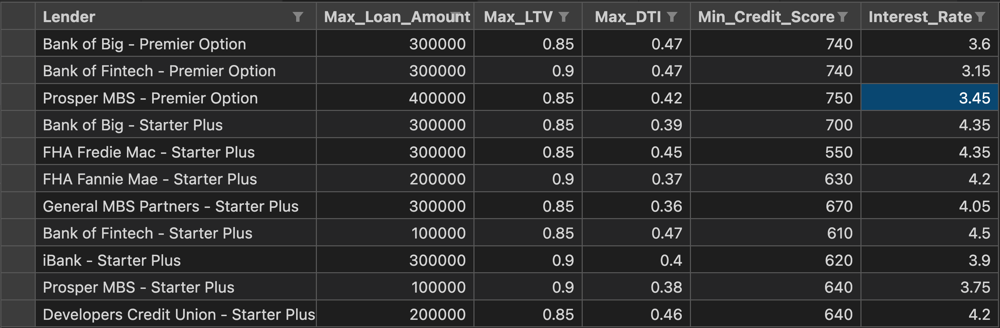

# Loan Qualifier App (Enhanced version)

This is a user friendly python enabled command line application to match applicants with qualifying loans provided by various lending companies rapidly and effortlessly.The application works by taking in a `daily_rate_sheet` of loan criteria from various loan providers,asking the user a number of questions to determine their loan eligibilty and providing a list of qualifying loans.It also allows user to save the qualifying loan data in a csv file. 


---

## Technologies

This project runs on python 3.7 and includes the following packages:

* [fire](https://github.com/google/python-fire) - For the command line interface, help page, and entrypoint.)

* [questionary](https://github.com/tmbo/questionary) - For interactive user prompts and dialogs)


---

## Installation Guide

To use the application you need to install the following dependencies.

```python
  pip install fire
  pip install questionary
```


## Usage

To use the loan qualifier application just clone the repository and run the **app.py** with:

```python
python app.py
```


Upon launching the application you will be greeted with the prompt to enter the path of csv file containing the loans, which is: **data/daily_rate_sheet.csv**





Enter the requested finacial data,you will get **monthly Debt to Income ratio**, **Loan to Value ratio** and the **Number of qualifying loans**. 





Then enter *Y* or *N* to save the qualifying loans as a csv file.If you choose not to save the file, the app will automatically exit. 



If you move forward with yes, you need to enter the path where you want to save the file.




*Final Output*




---

## Contributors
Manisha Lal     06/26/2022
manisha.lal.2009@gmail.com


---

## License

copyright 2022